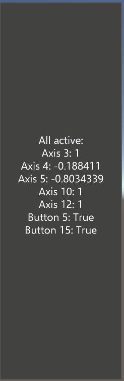

# Controller mapping tool

The controller mapping tool is a runtime (on device or in the editor) tool that enables developers to quickly determine the Unity input axis and button mappings for a hardware controller (ex: motion controller).

This tool is very useful when developing support for a new hardware controller. It can also help to confirm a suspected control mapping issue in the support class for an existing controller.

## Using the controller mapping tool

To get started with the controller mapping tool, navigate to **MRTK/Tools/RuntimeTools/Tools/ControllerMappingTool** and open the **ControllerMappingTool** scene. Once the scene has been loaded, the project can either be run in the editor, using play mode, or built and run on a device.

To examine Unity's mappings for a controller:

- Connect the controller
- Press each button and move each axis
- Note the mappings in the display
- Update the control mappings in the input system data provider for the controller

> [!NOTE]
> The controller mapping tool does not make use of Microsoft Mixed Reality Toolkit components. It directly communicates with Unity to determine and display the control mappings.

### All controls display

The large display panel reports the state of all defined Unity input axes and buttons (ex: Axis 10, Button 3). This panel provides a complete view of the state of the controller.

### Active controls display

The smaller, narrow display panel shows the Unity input axed and buttons which are in an active state (ex: a button is pressed). The active controls display provides an easy to read summary view of the state of the controller.

## See also

- [Creating an input system data provider](../Input/CreateDataProvider.md)
- [InputFeatureUsage tool](./InputFeatureUsageTool.md)
