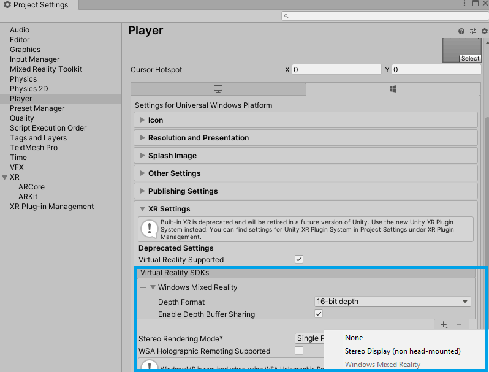
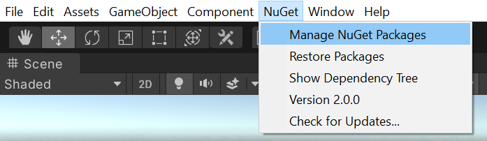
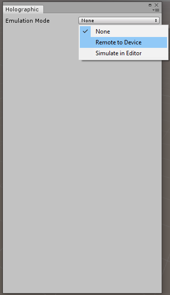
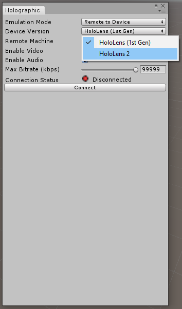
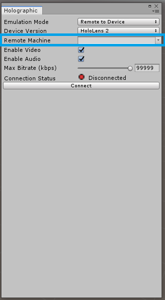

# Holographic Remoting

Holographic remoting streams holographic content from a PC to your Microsoft HoloLens in real-time, using a Wi-Fi or USB cable connection. This feature can significantly increase developer productivity when developing mixed reality applications.

## Initial setup

To enable remoting to a HoloLens, it is important to ensure that the project is using the latest remoting components.

1. Open **Window > Package Manager**
    - Verify that latest version of the **Windows Mixed Reality** package is installed.
1. Ensure the latest Holographic Remoting application is installed, on the HoloLens, via the Microsoft Store.

### HoloLens 2

When using a HoloLens 2, support for remoting articulated hand and eye tracking data has been added to MRTK. To enable these features, please select **Mixed Reality Toolkit** > **MSBuild** > **Use MSBuild for Unity dependency resolution**. This will install the required dependencies for Holographic Remoting.

Once MSBuild completes the import process, the next step is to select **Mixed Reality Toolkit** > **Utilities** > **Windows Mixed Reality** > **Check Configuration**. This step adds a scripting define that enables the DotNetWinRT dependency that is installed by MSBuild for Unity.

Some versions of Unity 2019 have encountered issues when using MSBuild for Unity. If the **Use MSBuild for Unity dependency resolution** option fails, please use the following steps to enable holographic remoting.

1. Set the target platform in **File > Build Settings** to **Universal Windows Platform**
1. If it does not automatically display, run the MRTK Configurator Utility (**Mixed Reality Toolkit > Utilities > Configure Unity Project**)
1. Click **Apply**
1. Open **Window > Package Manager**
    - Ensure that the **Windows XR Plugin** is not installed if the project isn't using [XR SDK](../GettingStartedWithMRTKAndXRSDK.md), as the legacy **Windows Mixed Reality** package will not function alongside it
1. Open **Edit > Project Settings > Player**

    

1. Ensure that **Virtual Reality Supported** is selected and that **Windows Mixed Reality** is added to the **Virtual Reality SDKs**

To enable tracking of hand joints and eye tracking, follow the steps in the **Debugging HoloLens 2 remoting via Unity package import** and related sections.

### Debugging HoloLens 2 remoting via Unity package import

If HoloLens 2 hand joints and eye tracking aren't working over remoting, there are a few common points of potential issues. They're listed below in the order they should be checked.

These issues are particularly relevant when running on **Unity 2019.3** or later.

#### MSBuildForUnity package import via writing into the package.manifest

To enable MSBuild for Unity, please run **Mixed Reality Toolkit** > **MSBuild** > **Use MSBuild for Unity dependency resolution**. After running this command, MSBuild should begin importing dependencies. It may take a few seconds for importing to begin.

The **Use MSBuild for Unity dependency resolution** command does not display a confirmation. To confirm that it succeeded, open **Window** > **Package Manager** and make sure MSBuild for Unity shows up in the packages list. If it's there, assume this step succeeded.

> [!Note]
> There is an issue that prevents MSBuild for Unity from functioning properly on some versions of Unity 2019. If issues are encountered, please refer to the [manual installation instructions](#manual-dotnetadapter-installation).


#### DotNetWinRT NuGet package resolution

The best way to check is to search the Assets folder for DotNetWinRT.dll. If this doesn't exist, navigate to the Assets folder in the Project view and select `[ProjectName].Dependencies.msb4u.csproj`. Assuming part 1 did succeed, there should be a custom inspector with Build, Rebuild, and Clean buttons. Try clicking Build or Rebuild, and then re-search for DotNetWinRT.dll. If that DLL now exists, this step succeeded.


#### DotNetAdapter.csproj missing

If the previous step didn't succeed, it's good to double check that the appropriate csproj exists in your project. Check under **MRTK** / **Providers** / **WindowsMixedReality** / **Shared** / **DotNetAdapter** and confirm that DotNetAdapter.csproj exists. One common case where this file might not exist is if your .gitignore ignores csproj files and you've committed the MRTK files to a remote repo. In this case, please make sure you force add DotNetAdapter.csproj with `git add -f [path/to]/DotNetAdapter.csproj` to make sure it gets committed and cloned for all other collaborators or computers.

#### `DOTNETWINRT_PRESENT` #define written into player settings

Beginning with MRTK version 2.5.0, for performance reasons, this define is no longer automatically set. To enable this flag, please use the **Mixed Reality Toolkit** > **Utilities** > **Windows Mixed Reality** > **Check Configuration** menu item.

> [!Note]
> The Check Configuration item does not display a confirmation. To confirm that the define has been set, please navigate to the Unity Player Settings. From there, under the UWP tab, check under Other Settings for the Scripting Define Symbols. Make sure DOTNETWINRT_PRESENT is properly written in that list. If that's there, this step succeeded.


#### Failure to find dotnet.exe

MSBuild for Unity depends on dotnet.exe existing in the system path - dotnet.exe must both be
installed and present in the PATH environment variable. If neither of those requirements are
 true, this error may manifest in the Unity console:

```cmd
Win32Exception: ApplicationName='dotnet', CommandLine='msbuild DotNetAdapter.csproj -restore  -v:minimal -p:NuGetInteractive=true  -t:Build -p:Configuration=Release -nologo', CurrentDirectory='C:\src\Assets\MRTK\Providers\WindowsMixedReality\Shared\DotNetAdapter', Native error= The system cannot find the file specified.
```

The solution to this is to ensure that the [.NET Core CLI tools are installed](https://docs.microsoft.com/dotnet/core/tools/?tabs=netcore2x) and reboot the system to force all apps to get a refreshed system path.

If hand joints over remoting are still not working after following the above steps, there might be something misconfigured in the profiles for general hand joints on-device. In that case, please [reach out on one of our help resources](../GettingStartedWithTheMRTK.md#getting-help).

#### Manual DotNetAdapter installation

In the event that the installation of the DotNetAdapter cannot be performed via MSBuild for Unity, the following steps can be performed.

> [!Important]
> Using both MSBuild for Unity and another NuGet client within the same project is not supported and can result in potential dependency resolution issues.

1. Install a NuGet client

    > [!Note]
    > The following instructions presume use of [NuGet for Unity](https://github.com/GlitchEnzo/NuGetForUnity/releases)

1. Navigate to the NuGet client UI

    

1. Locate the `Microsoft.Windows.MixedReality.DotNetWinRT` package

    

1. Select Install


### Removing HoloLens 2-specific remoting support

If you're running into conflicts or other issues due to the presence of the DotNetWinRT adapter, please [reach out on one of our help resources](../GettingStartedWithTheMRTK.md#getting-help).

You can also temporarily remove the adapter to workaround your issue via the following steps:

1. In Unity, go to Window -> Package Manager and uninstall MSBuild for Unity.
1. Search for DotNetWinRT.dll in your assets list in Unity and either delete the DLL or delete the Plugins (MRTK 2.2 or earlier) or Dependencies (MRTK 2.3 or later) folder that contains it a few levels up. That should remove these conflicting namespaces, while keeping MRTK around.
1. (Optional) Navigate to MRTK / Providers / WindowsMixedReality / Shared / DotNetAdapter in your file explorer (not Unity's Assets view) and delete the `.bin` and `.obj` folders. This removes the local cache of NuGet restored packages for DotNetWinRT.
1. If you run the MRTK Configurator again, make sure you don't re-enable MSBuild for Unity.

## Connecting to the HoloLens with Wi-Fi

Once the project has been configured, a connection can be established to the HoloLens.

1. In **File > Build Settings**, ensure that the project build type is set to **Universal Windows Platform**
1. On the HoloLens, launch the **Holographic Remoting** application.
1. In Unity, select **Window > XR > Holographic Emulation**.

    

1. Set **Emulation Mode** to **Remote to Device**.

    

1. Select the **Device Version**.

    

1. Using the IP Address displayed by the Holographic Remoting Player application, set the **Remote Machine** field.

    

1. Click **Connect**.

> [!NOTE]
> If you cannot connect, make sure your HoloLens 2 is not plugged in to your PC and restart Unity.

## Connecting to the HoloLens with USB cable

USB cable connection gives better rendering quality and stability. To use USB cable connection, disconnect from the HoloLens from Wi-Fi in HoloLens's Settings and launch Holographic Remoting Player app. It will display an IP address that starts with 169. Use this IP address in Unity's Holographic Emulation setting to connect. Once the IP address for USB cable has been identified, it is safe to connect the HoloLens to Wi-Fi again. 

## Starting a remoting session

With Unity connected to the HoloLens, enter play mode in the editor.

When the session is complete, exit play mode.

> [!NOTE]
> There is a known issue with some versions of Unity where the editor may hang upon entering play mode during a remoting session. This issue may manifest if the Holographic window is open when the project is loaded. To ensure this issue does not occur, always close the Holographic dialog prior to exiting Unity.

## See also

- [Holographic Remoting troubleshooting and limitations](https://docs.microsoft.com/windows/mixed-reality/holographic-remoting-troubleshooting)
- [Microsoft Holographic Remoting software license terms](https://docs.microsoft.com/legal/mixed-reality/microsoft-holographic-remoting-software-license-terms)
