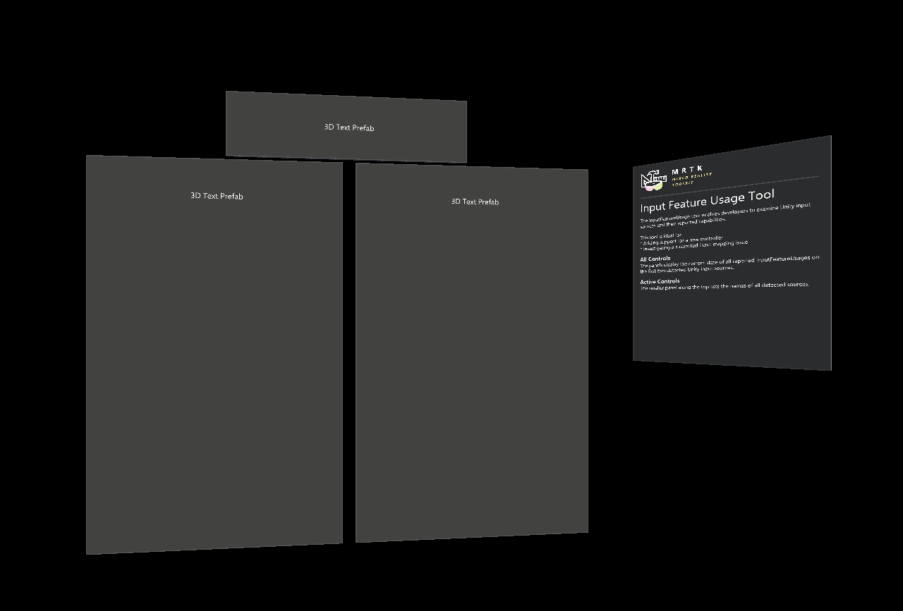

# InputFeatureUsage tool

The InputFeatureUsage tool is a runtime (on device or in the editor) tool that enables developers to quickly determine the available Unity InputFeatureUsages for a detected input source (ex: motion controller or articulated hand).

> [!NOTE]
> This scene only works on Unity 2019.3 or later.

This tool is very useful when developing support for a new hardware controller. It can also help to confirm a suspected control mapping issue in the support class for an existing controller.

## Using the InputFeatureUsage tool

To get started with the InputFeatureUsage tool, navigate to **MRTK/Tools/RuntimeTools/Tools/InputFeatureUsageTool** and open the **InputFeatureUsageTool** scene. Once the scene has been loaded, the project can either be run in the editor, using play mode, or built and run on a device.

To examine Unity's mappings for a controller:

- Connect the controller
- Press each button and move each axis
- Note the feature usages in the display
- Update the control mappings in the input system data provider for the controller

> [!NOTE]
> The InputFeatureUsage tool does not make use of Microsoft Mixed Reality Toolkit components. It directly communicates with Unity to determine and display the feature usages.

### Panels

The panels display the current state of all reported InputFeatureUsages on the first two detected Unity input sources.

The smaller panel along the top lists the names of all detected sources.

## See also

- [Creating an input system data provider](../Input/CreateDataProvider.md)
- [Controller mapping tool](./ControllerMappingTool.md)
