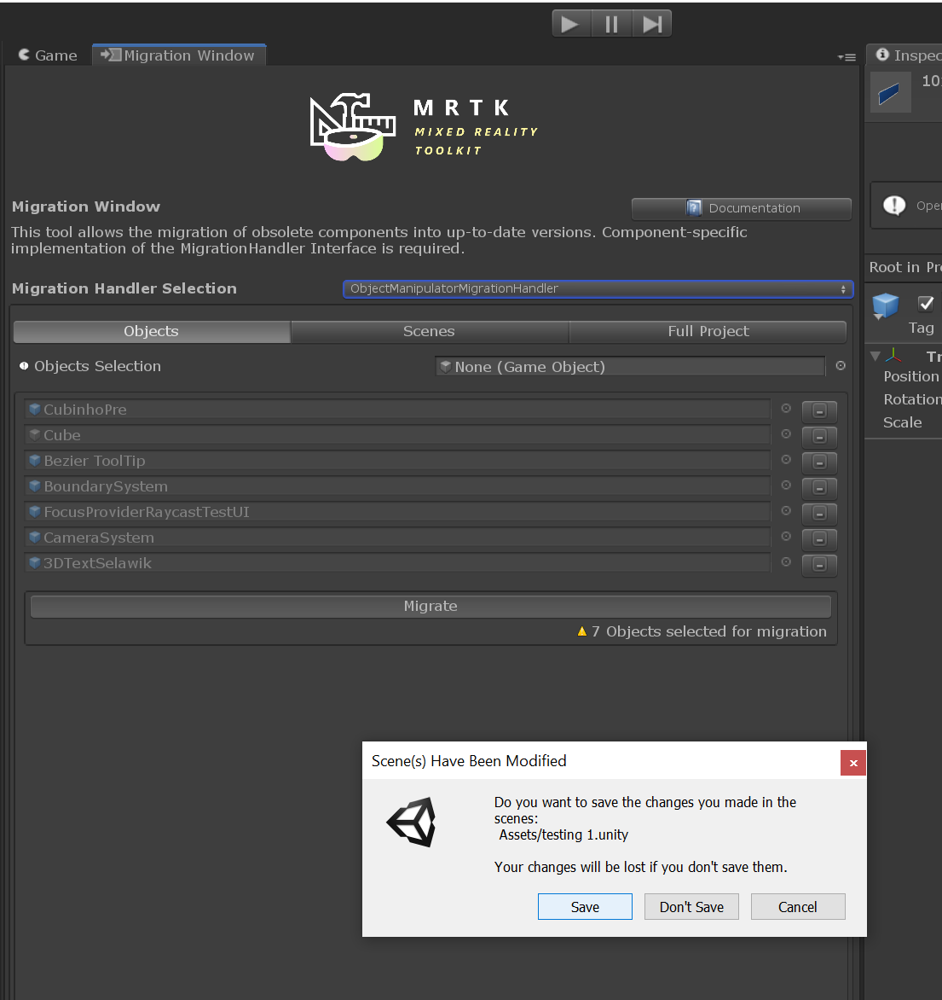
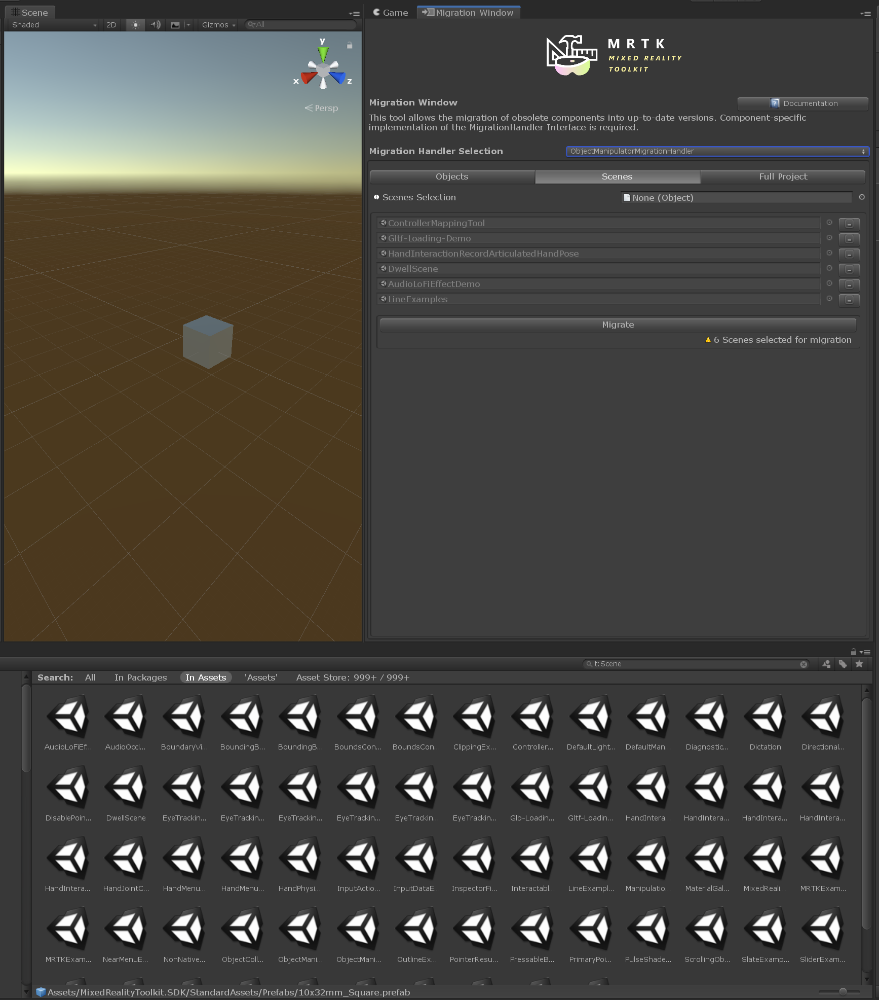

# Migration window

As the MRTK undergoes changes, some components might get deprecated and replacements will get introduced.
The migration window is a tool that helps users to automatically migrate a subset of those deprecated components to the new replacements.

## Usage

To open the window, select *Mixed Reality Toolkit* > *Utilities* > *Migration Window*. Once the migration window is open, the selection mode navigation tabs can be enabled by choosing the component specific implementation of the migration handler.  

### Object mode

Selecting the objects tab enables the object Field to where the user can drag and drop any Game objects from the currently open scene or prefabs from the project folder to be migrated.
Pressing the remove *(-)* button displayed at the right side of the listed object removes the object from the selection list.

Once all the desired objects are in the list, pressing the *Migrate* button will apply the changes required by the chosen migration handler implementation to all components in the selection that match the implementation.

### Scene mode

Allows user to drag and drop scene assets containing objects to be migrated.

### Project mode

Pressing the *Migrate* button will update the component targeted by the migration handler implementation for all prefabs and scenes in the project.

## See also

- [Updating from earlier versions](../Updating.md)
- [Microsoft Mixed Reality Toolkit releases](../ReleaseNotes.md)
- [MRTK roadmap](../Contributing/Roadmap.md)
