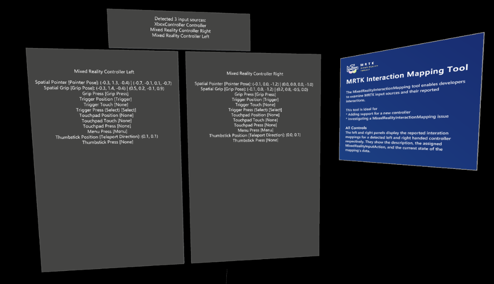

# MixedRealityInteractionMapping tool

The MixedRealityInteractionMapping tool is a runtime (on-device or in the editor) tool that enables developers to examine MRTK input sources and their MRTK-mapped interactions, to quickly determine if the mappings for a detected input source (ex: motion controller or articulated hand) are correct.

This tool is useful when developing support for a new hardware controller. It can also help to confirm a suspected control mapping issue in the support class for an existing controller.

## Using the MixedRealityInteractionMapping tool

To get started with the MixedRealityInteractionMapping tool, navigate to **MRTK/Tools/RuntimeTools/Tools/MixedRealityInteractionTool** and open the **MixedRealityInteractionTool** scene. Once the scene has been loaded, the project can either be run in the editor using play mode or built and run on a device.

To examine the MRTK's mappings for a controller:

- Connect the controller
- Press each button and move each axis
- Note the interaction mappings in the display
- Update the control mappings in the input system data provider for the controller, if needed

### Panels

The MixedRealityInteractionMapping tool enables developers to examine MRTK input sources and their reported interactions.

## See also

- [Creating an input system data provider](../Input/CreateDataProvider.md)
- [Controller mapping tool](./ControllerMappingTool.md)
- [InputFeatureUsage tool](./InputFeatureUsageTool.md)
