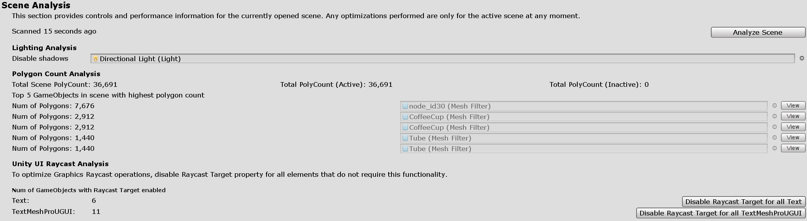

# Optimize window

The MRTK Optimize Window is a utility to help automate and inform in the process of configuring a mixed reality project for best [performance](../Performance/PerfGettingStarted.md) in Unity. This tool generally focuses on rendering configurations that when set to the correct preset can save milliseconds of processing.

The *Active Build Target* is the [build platform currently targeted](https://docs.unity3d.com/Manual/BuildSettings.html) by the project for compiling.

The *Performance Target* instructs the optimize tool on what kind of device endpoints to target.

- *AR Headsets* are mobile-class devices, such as HoloLens
- *VR Standalone* are mobile-class devices, such as the Oculus Go or Quest
- *VR Tethered* are PC-powered devices, such as the Samsung Odyssey, Oculus Rift or HTC Vive etc.

## Setting optimizations

The settings optimization tab covers some of the important rendering configurations for a Unity project. This section can help automate and inform you of which settings should be changed for the best performing results.

A green check icon means that an optimal value has been configured in the project/scene for this particular setting. A yellow warning icon indicates the current configuration can be improved. Clicking the associated button in a given section will auto-configure that setting in the Unity project/scene to a more optimal value.

### Single Pass Instanced rendering

[Single Pass instanced rendering](https://docs.unity3d.com/Manual/SinglePassInstancing.html) is the most efficient rendering path for mixed reality applications. This configuration ensures the render pipeline is executed only once for both eyes and that draw calls are instanced across both eyes.

### Depth buffer sharing

To improve [hologram stabilization](../hologram-Stabilization.md), developers can share the application's depth buffer which gives the platform information on where and what holograms to stabilize in the rendered scene.

### Depth buffer format

Furthermore, for *AR Headsets*, it is recommended to utilize a 16-bit depth format when enabling depth buffer sharing compared to 24-bit. This means lower precision but saves on performance. If [z-fighting](https://en.wikipedia.org/wiki/Z-fighting) occurs because there is less precision in calculating depth for pixels, then it is recommended to move the [far clip plane](https://docs.unity3d.com/Manual/class-Camera.html) closer to the camera (ex: 50m instead of 1000m).

> [!NOTE]
> If using *16-bit depth format*, stencil buffer required effects will not work because [Unity does not create a stencil buffer](https://docs.unity3d.com/ScriptReference/RenderTexture-depth.html) in this setting. Selecting *24-bit depth format* conversely will generally create an [8-bit stencil buffer](https://docs.unity3d.com/Manual/SL-Stencil.html), if applicable on the endpoint graphics platform.
>
> If using a [Mask component](https://docs.unity3d.com/Manual/script-Mask.html) which requires the stencil buffer, consider using [RectMask2D](https://docs.unity3d.com/Manual/script-RectMask2D.html) instead, which does not require the stencil buffer and thus can be used in conjunction with a *16-bit depth format*.

### Real-time Global Illumination

[Real-time Global illumination](https://docs.unity3d.com/Manual/GIIntro.html) in Unity can provide fantastic aesthetic results but at a very high cost. Global illumination lighting is very expensive in mixed reality and thus it is recommended to disable this feature in development.

> [!NOTE]
> Global illumination settings in Unity are set per-scene and not once across the entire project.

## Scene analysis

The *Scene Analysis* tab is designed to inform developers on which elements currently in the scene will likely have the most impact on performance.

### Lighting analysis

This section will examine the number of lights currently in the scene, as well as any lights that should disable shadows. Shadow casting is a very expensive operation.

### Polygon count analysis

The tool also provides polygon count statistics. It can be very helpful to quickly identify which GameObjects have the highest polygon complexity in a given scene to target for optimizations.

### Unity UI raycast analysis

Graphics raycast operations are performed per pointer in MRTK to determine if any Unity UI elements are in focus. These raycasts can be quite expensive and to help improve performance, UI elements that do not need to be returned in the results should be disabled as raycast targets. Every [Graphic](https://docs.unity3d.com/2018.4/Documentation/ScriptReference/UI.Graphic.html) element has a [`Graphic.raycastTarget`](https://docs.unity3d.com/2018.4/Documentation/ScriptReference/UI.Graphic-raycastTarget.html) property. This tool will search for text UI elements that have this property enabled and thus are likely candidates to be disabled.

## Shader analysis

The [Unity Standard shader](https://docs.unity3d.com/Manual/shader-StandardShader.html) can produce very high quality visual results for games but is not generally best suited for the performance needs of mixed reality applications, especially since such applications are generally GPU bounded. Thus, it is recommended to developers to utilize the [MRTK Standard shader](../README_MRTKStandardShader.md) to balance aesthetics & graphical features with performance.

The *Shader Analysis* tab scans the current project's Asset folder for materials using the Unity Standard shader or if desired, all materials not using Mixed Reality Toolkit provided shaders. Once discovered, developers can convert all materials or convert individually using the appropriate buttons.

## See also

- [Performance](../Performance/PerfGettingStarted.md)
- [Hologram Stabilization](../hologram-stabilization.md)
