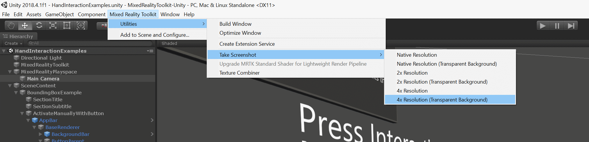

# Screenshot utility

Often taking screenshots in Unity for documentation and promotional imagery can be burdensome and the output often looks less than desirable. This is where the `ScreenshotUtility` (xref:Microsoft.MixedReality.Toolkit.Utilities.Editor.ScreenshotUtility) class comes into play.

The ScreenshotUtility class aides in taking screenshots via menu items and public APIs within the Unity editor. Screenshots can be captured at various resolutions and with transparent clear colors for use in easy post compositing of images. Taking screenshots from a standalone build is not supported by this tool.

## Taking screenshots

Screenshots can be easily capture while in the editor by selecting *Mixed Reality Toolkit->Utilities->Take Screenshot* and then selecting your desired option. Make sure to have the game window tab visible if capturing while not playing, or a screenshot may not be saved.

By default, all screenshots are saved to your [temporary cache path](https://docs.unity3d.com/ScriptReference/Application-temporaryCachePath.html), the path to the screenshot will be displayed in the Unity console.

## Example screenshot capture

The below screenshot was captured with the *"4x Resolution (Transparent Background)"* option. This outputs a high-resolution image with whatever pixels normally represented by the clear color saved as transparent pixels. This technique helps developers showcase their application for the store, or other media outlets, by overlaying this image on top of other imagery.

