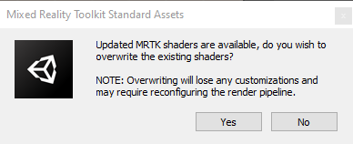
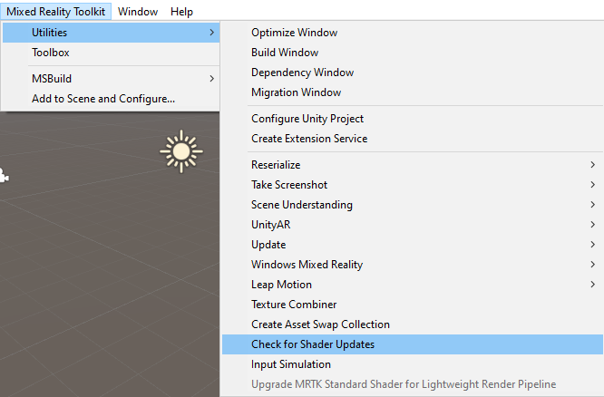

# Updating Shaders

Starting with version 2.6.0, the MRTK shaders are being versioned via the MRTK.Shaders.sentinel file. When upgrading to a new version of MRTK, the following message may appear.

Selecting **Yes** instructs MRTK to overwrite the contents of **Assets** > **MRTK** > **Shaders** with the latest version.

> [!IMPORTANT]
> When overwriting the shader files, any custom modifications will be lost. Be sure to backup any modified shader files before upgrading.
>
> If the project has been configured to use the Universal Render Pipeline (URP) - formerly Lightweight Render Pipeline (LWRP), please re-run **Mixed Reality Toolkit** > **Utilities** >
> **Upgrade MRTK Standard Shader for Lightweight Render Pipeline**.

At is also possible to check for shader updates at any time using **Mixed Reality Toolkit** > **Utilities** > **Check for Shader Updates** on the Unity Editor's menu bar.

> [!NOTE]
> Checking for shader updates is not required when importing the MRTK .unitypackage files.