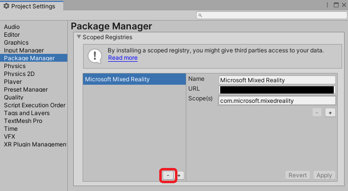
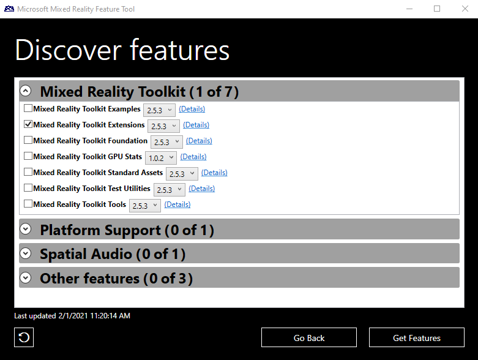

# Mixed Reality Toolkit and Unity Package Manager

Starting with version 2.5.0, using the [Mixed Reality Feature Tool](https://aka.ms/MRFeatureToolDocs), the Microsoft Mixed Reality Toolkit integrates with the Unity Package Manager (UPM) when using Unity 2019.4 and newer.

## Using the Mixed Reality Feature Tool

As described in [Welcome to the Mixed Reality Feature Tool](https://aka.ms/MRFeatureToolDocs) you can download the tool using [this link](https://aka.ms/MRFeatureTool).

> [!IMPORTANT]
> If the project's manifest has a `Microsoft Mixed Reality` entry in the `scopedRegistries` section, it is recommended that it be removed.
>
> To remove a configured scoped registry, please to to `Edit` > `Project Settings` > `Package Manager`.
>
> 

MRTK packages appear under the `Mixed Reality Toolkit` heading when discovering features.

When selecting features, there is no need to be concerned with required dependencies, the tool will automatically download and integrate them into the project.

## Managing Mixed Reality features with the Unity Package Manager

Once a Mixed Reality Toolkit package has been added to the package manifest, it can be managed using the Unity Package Manager user interface.

> [!NOTE]
> If a Mixed Reality Toolkit package is removed using the Unity Package Manager, it will have to be re-added using the [previously described steps](#using-the-mixed-reality-feature-tool).

### Using Mixed Reality Toolkit examples

Unlike when using asset package (.unitypackage) files, `com.microsoft.mixedreality.toolkit.examples` and `com.microsoft.mixedreality.toolkit.handphysicsservice` do not automatically import the example scenes and assets.

To utilize one or more of the examples, please use the following steps:

1. In the Unity Editor, navigate to `Window` > `Package Manager`
1. In the list of packages, select `Mixed Reality Toolkit Examples`
1. Locate the desired sample(s) in the `Samples` list
1. Click `Import into Project`

When an example package is updated, Unity provides the option to update imported samples.

> [!NOTE]
> Updating an imported sample will overwrite any changes that have been made to that sample and the associated assets.

## See Also

- [Mixed Reality Toolkit packages](Packaging/MRTK_Packages.md)
