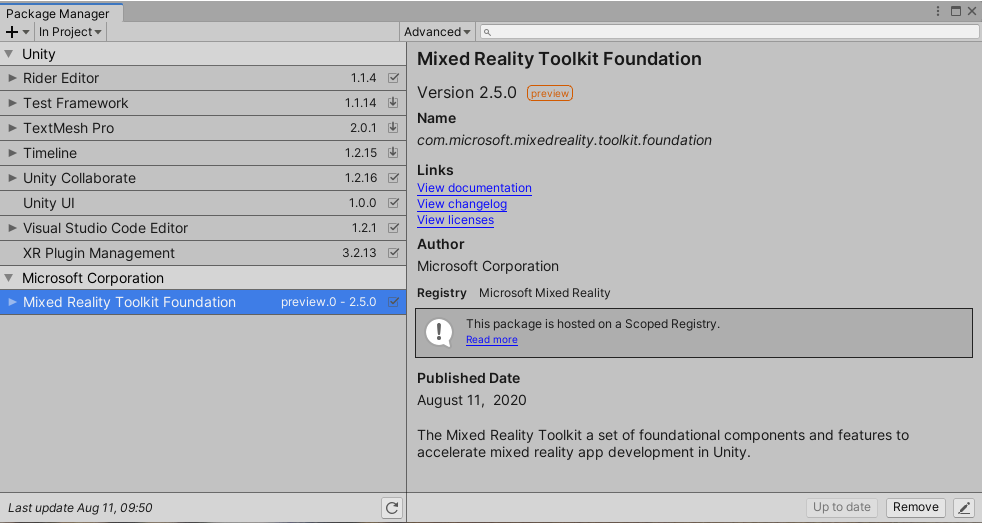
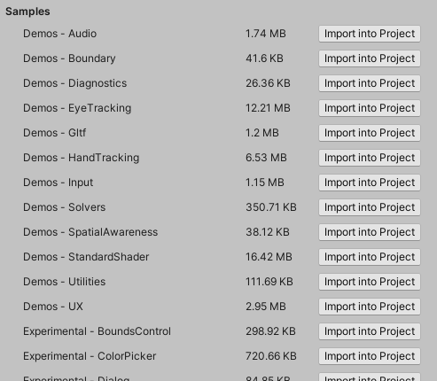

# Mixed Reality Toolkit and Unity Package Manager

Starting with version 2.5.0, the Microsoft Mixed Reality Toolkit is available using the Unity Package Manager (UPM), on Unity 2019.4 and newer.

## Installing Mixed Reality features using the Unity Package Manager

The Unity Package Manager uses a [manifest file](https://docs.unity3d.com/Manual/upm-manifestPkg.html) (manifest.json) to determine which packages to install and the registries (servers) from which they can be installed.

> [!Note]
> As of version 2.5.0 of the MRTK, initial registration of the server and packages is a per-project, manual procedure, please read the following sections for detailed instructions.
> 
> This process is required due to UPM's use of legacy npm search functionality (/-/all) that is not supported by Azure DevOps.

### Registering the Mixed Reality component server

For each project that will be using the Microsoft Mixed Reality Toolkit, the `manifest.json` file (in the Packages folder) will need to have the Mixed Reality scoped registry added. The following illustrate how to properly modify `manifest.json` to support Mixed Reality.

1. Open `<projectRoot>/Packages/manifest.json` in a text editor, such as [Visual Studio Code](https://code.visualstudio.com/).
1. At the top of the manifest file, add the Mixed Reality server to the scoped registry section and save the file.

```
{
  "scopedRegistries": [
    {
      "name": "Microsoft Mixed Reality",
      "url": "https://pkgs.dev.azure.com/aipmr/MixedReality-Unity-Packages/_packaging/Unity-packages/npm/registry/",
      "scopes": [
        "com.microsoft.mixedreality",
        "com.microsoft.spatialaudio"
      ]
    }
  ],
```

### Adding MRTK packages

Once the Microsoft Mixed Reality scoped registry has been added to the manifest, the MRTK packages can be specified.

The [Unity Package Manager](Packaging/MRTK_Packages.md#unity-package-manager) section of the [Mixed Reality Toolkit package](Packaging/MRTK_Packages.md) article describes the available MRTK packages, their contents and the scenarios for their use.

To add an MRTK package, modify the dependencies section of the `Packages/manifest.json` file. The following example illustrates adding the foundation, tools and examples packages, the standard assets package will be added automatically as a dependency of the foundation.

```
  "dependencies": {
    "com.microsoft.mixedreality.toolkit.foundation": "2.5.0",
    "com.microsoft.mixedreality.toolkit.tools": "2.5.0",
    "com.microsoft.mixedreality.toolkit.examples": "2.5.0",
```

## Managing Mixed Reality features with the Unity Package Manager

Once a Mixed Reality Toolkit package has been added to the package manifest, it can be managed using the Unity Package Manager user interface.



> [!Note]
> If a Mixed Reality Toolkit package is removed using the Unity Package Manager, it will have to be re-added using the [previously described steps](#adding-mrtk-packages).

### Using Mixed Reality Toolkit examples

Unlike when using asset package (.unitypackage) files, `com.microsoft.mixedreality.toolkit.examples` and `com.microsoft.mixedreality.toolkit.handphysicsservice` do not automatically import the example scenes and assets.

To utilize one or more of the examples, please use the following steps:

1. In the Unity Editor, navigate to `Window` > `Package Manager`
1. In the list of packages, select `Mixed Reality Toolkit Examples`
1. Locate the desired sample(s) in the `Samples` list
1. Click `Import into Project`



When an example package is updated, Unity provides the option to update imported samples.

> [!Note]
> Updating an imported sample will overwrite any changes that have been made to that sample and the associated assets.

## See Also

- [Mixed Reality Toolkit packages](Packaging/MRTK_Packages.md)
