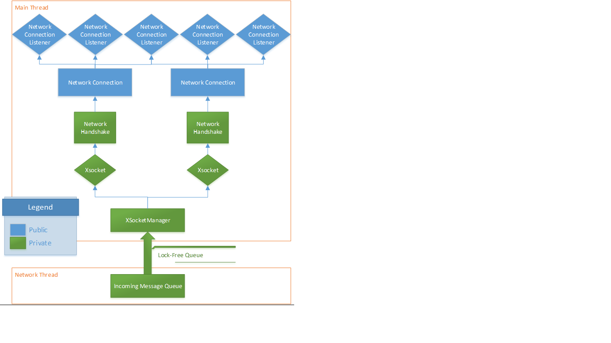

Low Level Message Routing                        {#messagerouting}
============
# Overview

All parts of the Sharing library use the same low level networking and message routing subsystem.   

### Threading
Client applications are assumed to be single threaded.  The Sharing API is designed such that users do not need to add any 
complex thread-safe logic to their application.  The user code must call SharingManager.Update() periodically to tell the 
library to call all the registered user callback functions.  The callbacks are made from the same thread that SharingManager.Update() 
is called from.  

### Incoming Message Queue
Incoming network traffic is received on a dedicated network thread.  Most packets are put into a queue to be consumed by the main thread, 
but you can optionally register to receive certain message types on the network thread.  This allows apps to respond to incoming messages 
immediately without waiting for the main thread to call SharingManager.Update().  This helps for example with timely delivery of latency 
and stall sensitive audio packets.  

### Lock-Free Queue
To avoid contention over mutex locks between the network and main threads, the incoming network messages are pushed onto a lock-free 
queue on the network thread, and then popped off the queue on the main thread.  

If the queue is full, the incoming messages are cached by the message queue object to be pushed onto to the lock-free queue later when there is room.  

If the incoming packet is bigger than the lock-free queue can hold, it is split into pieces on the network thread, and reassembled on the main thread

### User-thread callbacks
To avoid forcing all user code to be thread-safe, the system is designed to only trigger callbacks for new incoming network messages when the 
User calls Update()

NetworkConnection are the main message passing class available through the Sharing API, and represents the interface to a remote machine, whether 
its connected or not.  It does not come and go during the lifetime of the app.  NetworkConnections look at the incoming packet and pass it to 
the NetworkConnectionListener that is registered to receive that message type.  Network messages are sent and received through an XSocket, which may change over its lifetime.  

XSockets are not exposed through the API.  They are used internally and are transient, representing the current connection to a remote machine.   
Raw outgoing packets are send through a socket, and incoming traffic is passed to a NetworkConnection without being examined.
