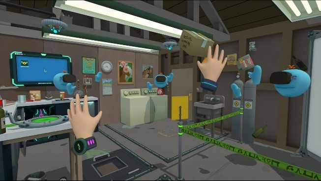
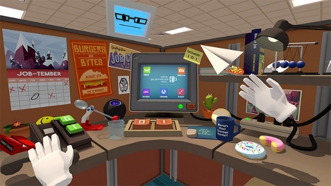
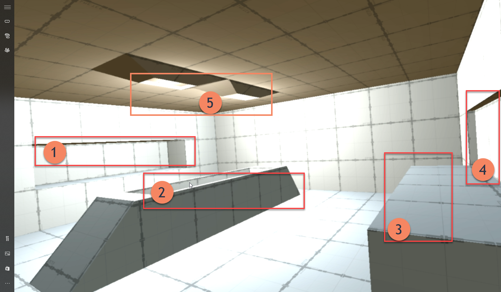
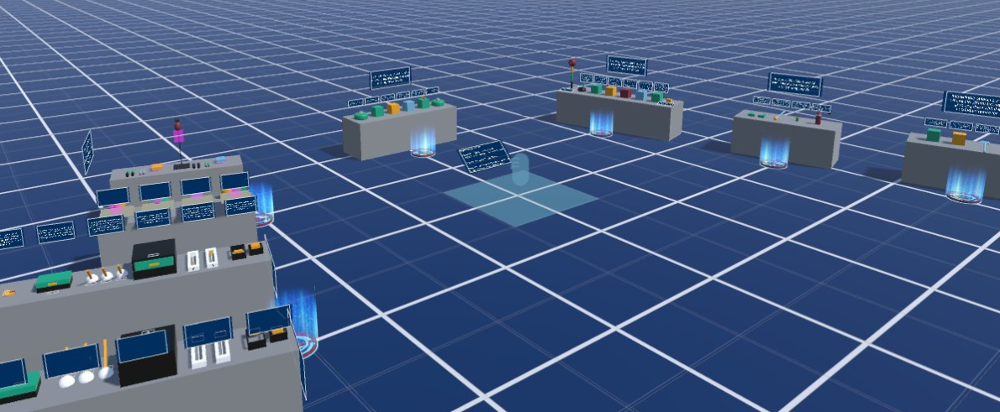

# Mixed Reality Toolkit – User SDK approach *(High level)*

## Problem Statement

Current examples / implementations are far too involved and require users to build new scripts / behaviours to build their project.  Users complain the project is too hard to pick up and the current examples are not conducive to implementation (only demonstration)

## Objective

To rearchitect the generic consumption of the Mixed Reality Toolkit to enable users to build scenes through easy to use “drag and drop” components.

An example workflow should resemble:

 * Consumer builds a 3D scene
 * MRTK is added to the project
 * Add a simple way to define walkable areas (Either through locomotion, free teleportation or restricted teleportation)
 * Enable selecting of an object in a scene and configuring it for interaction (pickup, push, throw, etc)
 * Enable animation interactions, e.g. opening doors
 * Enable passive interactions, interacting one object with another that is in control by the player
 * Quickly add Speech / Gesture / Focus / Controller services

(purely a working set, needs refining)

The ultimate goal is to deliver new users (and existing) with a rapid way to build projects / scenes, trying to cover the 80/20 rule.
The simple promise for users building with these controls, is that they should always work, regardless of our plans under the hood for MRTK and preserve the projects they build. 

## High Level required components

In transforming the frontend of the MRTK for consumers to construct their projects / scenes with, we need to define and develop a simple set of prefabs / scripts / Editor options to quickly and easily add MRTK activities / behaviors to a 3D scene (or virtual scene in the case of HoloLens)
These can be categorized as:

### Scene elements

Scene elements relate to management style components / configuration to activate core components for the MRTK.  Current elements would include:

 * Camera (current MRCP)
 * Managers (focus / gaze / controllers / motion controllers / etc)
 * Controllers (scene object collections, interactions)

### Interaction controls

Controls from how the user moves and interacts in the scene, ranging from:

 * Locomotion / Teleportation control
 * Locomotion / Teleportation boundaries / targets
 * Speech commands
 * Gestures
 * Pointers / Hands

### Reaction Controls

These components relate to things the user will interact with in a scene, enabling the player to affect the scene, ranging from:

 * Grabbing
 * Pushing
 * Opening
 * Pointer targets
 * Buttons / UX
 * Hot Zones (reaction-based events from either the player or an interaction control collision)
 * Highlighting

### UX Systems

In any project the user will need a friendly UX system to assist in their scenes, for example:

 * Menu Systems (Grid / Radial)
 * Layout components (Grid / Radial / Curved / Layered)
 * Controller systems (menu overlays for hands / controllers)
 * Tooltips
 * Fade Assist

> **This is not an extensive list and subject to debate.**

## Initial Plans

The proposal is to build a small subset of controls that utilize the current functionality of the MRTK, applying the above objectives and principles to define some of the high-Level components.

An initial scene which should support both HL & Immersive (subject to discussion, separate may be easier for now), should walk a user in a common room style scenario.

The example (lending from the Cliffhouse setup) should display a simple room, with hot spot teleport zones and activities that can be performed at each location, something akin to Rick and Morty VR or Job Simulator:

 Figure 1 : Reference examples (Rick and Morty / Job Simulator) 

The example should include a walk-through example for building the scene in Unity that any consumer can follow, starting from the empty room populated with some simple elements, e.g.

 * Buttons that show text on a wall – showing button interaction
 * Mugs that you can pick up (stretch and empty liquid :P) – showing grabbing / dropping
 * A puzzle where you slide tiles around a maze – showing pushing constrained objects around

More examples can be added to the same room, building from a simple start.
We ensure we build the components to meet these objectives and refine as necessary.  The example scene and starter components should then be added to the existing MRTK solution for testing / consumption whilst more are built.

## Work in progress

The team have been working on the initial SDK setup scene with the first components, aims to have (as a start):

 * A starting workroom with defined workplaces
 * An area to pick up and interact with objects
 * An area to push objects around, possibly pick up
 * An area with buttons and UX interactive elements
 * A UX panel display area

### Current working scene

 Figure 2 : Work in progress example scene 1 
 

Elements being built in to the scene:

1. Alcove for object to pick up, thinking a cube, cylinder, cup, picture frame
2. A contained bin where balls will be dropped from *5 when buttons are pressed. Balls can be pushed around and possibly picked up and thrown
3. Button table for push interaction UX items
4. Display frame and information box area.  Should also have some switchable indicators
5. Drop points for adding new spheres

For HoloLens, the room would not be displayed, and objects should interact with the environment, e.g.

 * Window or shelf for the Alcove (1)
 * Table for buttons (3) with Display elements in 4 floating
 * Elements dropped from (5) will just drop and interact with the Spatial Mesh

# Reference Example

VRTK are refactoring / rebuilding their new example scenes for their next release, which show an interesting path for example scenes:

 Figure 3 : Reference, VRTK new samples 

These do look cleaner and easier to digest, this doesn’t change how VRTK is currently implemented which is part of the work detailed here.
But it is a great showcase for the quality level we should be aiming for which has started with Yoon’s updates to the examples.
