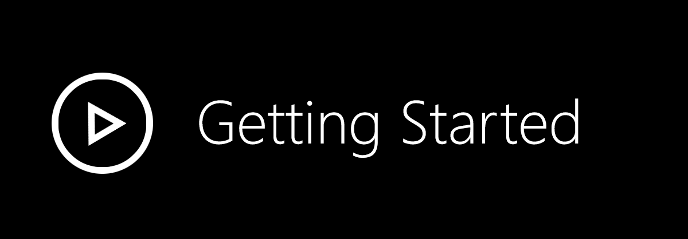
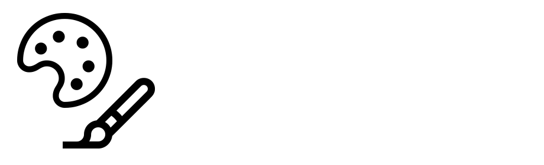
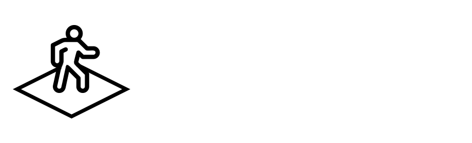
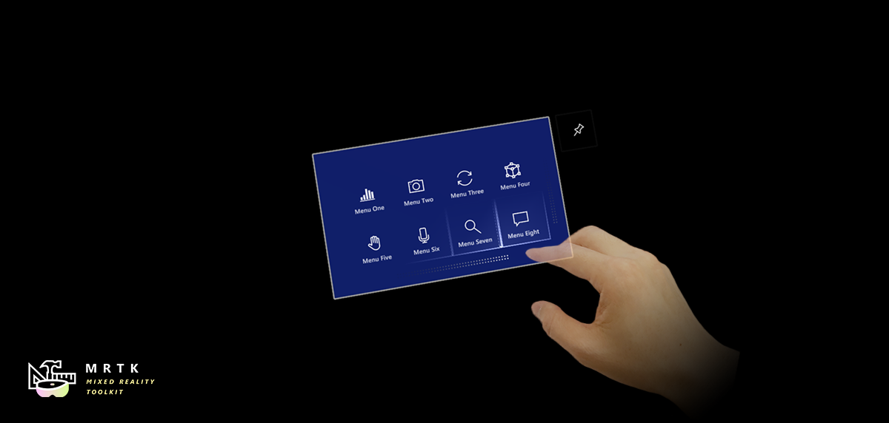
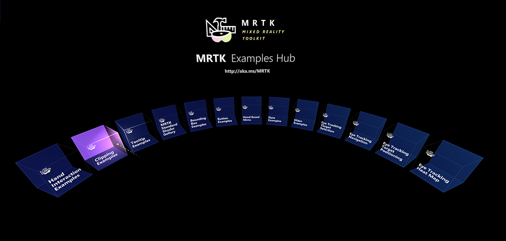
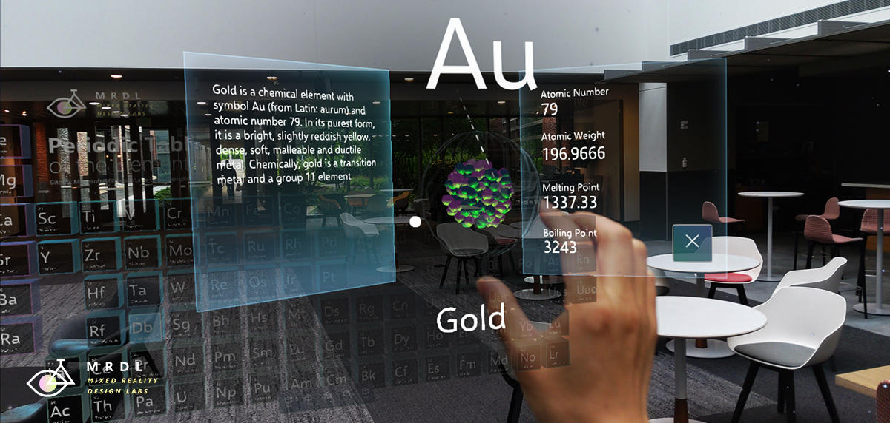
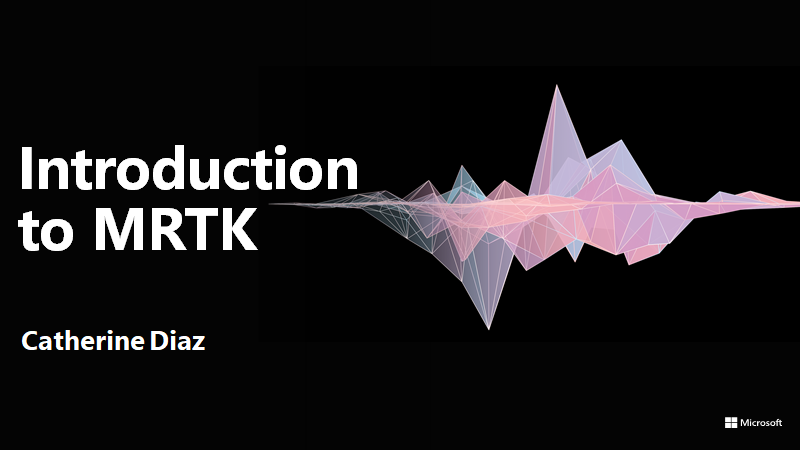

# What is the Mixed Reality Toolkit

MRTK-Unity is a Microsoft-driven project that provides a set of components and features, used to accelerate cross-platform MR app development in Unity. Here are some of its functions:

* Provides the **cross-platform input system and building blocks for spatial interactions and UI**.
* Enables **rapid prototyping** via in-editor simulation that allows you to see changes immediately.
* Operates as an **extensible framework** that provides developers the ability to swap out core components.
* **Supports a wide range of platforms**, including
  * Microsoft HoloLens
  * Microsoft HoloLens 2
  * Windows Mixed Reality headsets
  * OpenVR headsets (HTC Vive / Oculus Rift)
  * Ultraleap Hand Tracking
  * Mobile devices such as iOS and Android

# Getting started with MRTK

|  [Getting Started](https://microsoft.github.io/MixedRealityToolkit-Unity/Documentation/GettingStartedWithTheMRTK.html)|  [MRTK Overview](https://microsoft.github.io/MixedRealityToolkit-Unity/Documentation/Architecture/Overview.html)|  [Feature Guides](https://microsoft.github.io/MixedRealityToolkit-Unity/Documentation/README_Button.html)|  [API Reference](https://microsoft.github.io/MixedRealityToolkit-Unity/api/Microsoft.MixedReality.Toolkit.html)|
|:---|:---|:---|:---|

# Build status

| Branch | CI Status | Docs Status |
|---|---|---|
| `mrtk_development` ||

# Required software

 |  [Windows SDK 18362+](https://developer.microsoft.com/windows/downloads/windows-10-sdk)|  [Unity 2018.4.x](https://unity3d.com/get-unity/download/archive)|  [Visual Studio 2019](http://dev.windows.com/downloads)|  [Emulators (optional)](https://docs.microsoft.com/windows/mixed-reality/using-the-hololens-emulator)|
| :--- | :--- | :--- | :--- |
| To build apps with MRTK v2, you need the Windows 10 May 2019 Update SDK.   To run apps for immersive headsets, you need the Windows 10 Fall Creators Update. | The Unity 3D engine provides support for building mixed reality projects in Windows 10 | Visual Studio is used for code editing, deploying and building UWP app packages | The Emulators allow you to test your app without the device in a simulated environment |

# Feature areas

|  [Input System](Documentation/Input/Overview.md) &nbsp;  |  [Hand Tracking  (HoloLens 2)](Documentation/Input/HandTracking.md) |  [Eye Tracking  (HoloLens 2)](Documentation/EyeTracking/EyeTracking_Main.md) |  [Profiles](Documentation/MixedRealityConfigurationGuide.md) &nbsp; |  [Hand Tracking (Ultraleap)](Documentation/CrossPlatform/LeapMotionMRTK.md)|
| :--- | :--- | :--- | :--- | :--- |
|  [UI Controls](README.md#ux-building-blocks) &nbsp; |  [Solvers](Documentation/README_Solver.md) &nbsp; |  [Multi-Scene  Manager](Documentation/SceneSystem/SceneSystemGettingStarted.md) |  [Spatial  Awareness](Documentation/SpatialAwareness/SpatialAwarenessGettingStarted.md) |  [Diagnostic  Tool](Documentation/Diagnostics/DiagnosticsSystemGettingStarted.md) |
|  [MRTK Standard Shader](Documentation/README_MRTKStandardShader.md?q=shader) |  [Speech](Documentation/Input/Speech.md)  & [Dictation](Documentation/Input/Dictation.md) |  [Boundary System](Documentation/Boundary/BoundarySystemGettingStarted.md)|  [In-Editor Simulation](Documentation/InputSimulation/InputSimulationService.md) |  [Experimental Features](Documentation/Contributing/ExperimentalFeatures.md)|

# UX building blocks

|   [Button](Documentation/README_Button.md) |  [Bounding Box](Documentation/README_BoundingBox.md) |  [Object Manipulator](Documentation/README_ObjectManipulator.md) |
|:--- | :--- | :--- |
| A button control which supports various input methods, including HoloLens 2's articulated hand | Standard UI for manipulating objects in 3D space | Script for manipulating objects with one or two hands |
|   [Slate](Documentation/README_Slate.md) |  [System Keyboard](Documentation/README_SystemKeyboard.md) |  [Interactable](Documentation/README_Interactable.md) |
| 2D style plane which supports scrolling with articulated hand input | Example script of using the system keyboard in Unity  | A script for making objects interactable with visual states and theme support |
|   [Solver](Documentation/README_Solver.md) |  [Object Collection](Documentation/README_ObjectCollection.md) |  [Tooltip](Documentation/README_Tooltip.md) |
| Various object positioning behaviors such as tag-along, body-lock, constant view size and surface magnetism | Script for laying out an array of objects in a three-dimensional shape | Annotation UI with a flexible anchor/pivot system, which can be used for labeling motion controllers and objects |
|   [Slider](Documentation/README_Sliders.md) |  [MRTK Standard Shader](Documentation/README_MRTKStandardShader.md) |  [Hand Menu](Documentation/README_HandMenu.md) |
| Slider UI for adjusting values supporting direct hand tracking interaction | MRTK's Standard shader supports various Fluent design elements with performance | Hand-locked UI for quick access, using the Hand Constraint Solver |
|   [App Bar](Documentation/README_AppBar.md) |  [Pointers](Documentation/Input/Pointers.md) |  [Fingertip Visualization](Documentation/README_FingertipVisualization.md) |
| UI for Bounding Box's manual activation | Learn about various types of pointers | Visual affordance on the fingertip which improves the confidence for the direct interaction |
|   [Near Menu](Documentation/README_NearMenu.md) |  [Spatial Awareness](Documentation/SpatialAwareness/SpatialAwarenessGettingStarted.md) |  [Voice Command](Documentation/Input/Speech.md) / [Dictation](Documentation/Input/Dictation.md) |
| Floating menu UI for the near interactions | Make your holographic objects interact with the physical environments | Scripts and examples for integrating speech input |
|   [Progress Indicator](Documentation/README_ProgressIndicator.md) |  [Dialog [Experimental]](Assets/MRTK/SDK/Experimental/Dialog/README_Dialog.md) |  [Hand Coach [Experimental]](Assets/MRTK/SDK/Experimental/HandCoach/README_HandCoach.md) |
| Visual indicator for communicating data process or operation | UI for asking for user's confirmation or acknowledgement  | Component that helps guide the user when the gesture has not been taught |
|   [Hand Physics Service [Experimental]](Assets/MRTK/Extensions/HandPhysicsService/README.md) |  [Scrolling Collection [Experimental]](Assets/MRTK/SDK/Experimental/ScrollingObjectCollection/README.md) |  [Dock [Experimental]](Assets/MRTK/SDK/Experimental/Dock/README_Dock.md) |
| The hand physics service enables rigid body collision events and interactions with articulated hands | An Object Collection that natively scrolls 3D objects | The Dock allows objects to be moved in and out of predetermined positions |
|   [Eye Tracking: Target Selection](Documentation/EyeTracking/EyeTracking_TargetSelection.md) |  [Eye Tracking: Navigation](Documentation/EyeTracking/EyeTracking_Navigation.md) |  [Eye Tracking: Heat Map](Documentation/EyeTracking/EyeTracking_ExamplesOverview.md#visualization-of-visual-attention) |
| Combine eyes, voice and hand input to quickly and effortlessly select holograms across your scene | Learn how to auto-scroll text or fluently zoom into focused content based on what you are looking at | Examples for logging, loading and visualizing what users have been looking at in your app |

# Tools

|   [Optimize Window](Documentation/Tools/OptimizeWindow.md) |  [Dependency Window](Documentation/Tools/DependencyWindow.md) |  Build Window |  [Input recording](Documentation/InputSimulation/InputAnimationRecording.md) |
|:--- | :--- | :--- | :--- |
| Automate configuration of Mixed Reality projects for performance optimizations | Analyze dependencies between assets and identify unused assets |  Configure and execute an end-to-end build process for Mixed Reality applications | Record and playback head movement and hand tracking data in editor |

# Example scenes

Explore MRTK's various types of interactions and UI controls in [this example scene](Documentation/README_HandInteractionExamples.md).

You can find  other example scenes under [**Assets/MixedRealityToolkit.Examples/Demos**](/Assets/MixedRealityToolkit.Examples/Demos) folder.

# MRTK examples hub

With the MRTK Examples Hub, you can try various example scenes in MRTK.
You can find pre-built app packages for HoloLens(x86), HoloLens 2(ARM), and Windows Mixed Reality immersive headsets(x64) under [**Release Assets**](https://github.com/microsoft/MixedRealityToolkit-Unity/releases/tag/v2.0.0) folder. [Use the Windows Device Portal to install apps on HoloLens](https://docs.microsoft.com/hololens/hololens-install-apps#use-the-windows-device-portal-to-install-apps-on-hololens). On HoloLens 2, you can downloand and install [MRTK Examples Hub through the Microsoft Store app](https://www.microsoft.com/en-us/p/mrtk-examples-hub/9mv8c39l2sj4).

See [Examples Hub README page](Documentation/README_ExampleHub.md) to learn about the details on creating a multi-scene hub with MRTK's scene system and scene transition service.

# Sample apps made with MRTK

| | | |
|:--- | :--- | :--- | 
| [Periodic Table of the Elements](https://github.com/Microsoft/MRDL_Unity_PeriodicTable) is an open-source sample app which demonstrates how to use MRTK's input system and building blocks to create an app experience for HoloLens and Immersive headsets. Read the porting story: [Bringing the Periodic Table of the Elements app to HoloLens 2 with MRTK v2](https://medium.com/@dongyoonpark/bringing-the-periodic-table-of-the-elements-app-to-hololens-2-with-mrtk-v2-a6e3d8362158) |[Galaxy Explorer](https://github.com/Microsoft/GalaxyExplorer) is an open-source sample app that was originally developed in March 2016 as part of the HoloLens 'Share Your Idea' campaign. Galaxy Explorer has been updated with new features for HoloLens 2, using MRTK v2. Read the story: [The Making of Galaxy Explorer for HoloLens 2](https://docs.microsoft.com/windows/mixed-reality/galaxy-explorer-update) |[Surfaces](https://github.com/Microsoft/GalaxyExplorer) is an open-source sample app for HoloLens 2 which explores how we can create a tactile sensation with visual, audio, and fully articulated hand-tracking. Check out Microsoft MR Dev Days session [Learnings from the Surfaces app](https://channel9.msdn.com/Shows/Docs-Mixed-Reality/Learnings-from-the-MR-Surfaces-App) for the detailed design and development story. |

# Session videos from Mixed Reality Dev Days 2020

| | | |
|:--- | :--- | :--- | 
| Tutorial on how to create a simple MRTK app from start to finish. Learn about interaction concepts and MRTK’s multi-platform capabilities. | Deep dive on the MRTK’s UX building blocks that help you build beautiful mixed reality experiences. | An introduction to performance tools, both in MRTK and external, as well as an overview of the MRTK Standard Shader.	 |

See [Mixed Reality Dev Days](https://docs.microsoft.com/en-us/windows/mixed-reality/mr-dev-days-sessions) to explore more session videos.

# Engage with the community

- Join the conversation around MRTK on [Slack](https://holodevelopers.slack.com/). You can join the Slack community via the [automatic invitation sender](https://holodevelopersslack.azurewebsites.net/).

- Ask questions about using MRTK on [Stack Overflow](https://stackoverflow.com/questions/tagged/mrtk) using the **MRTK** tag.

- Search for [known issues](https://github.com/Microsoft/MixedRealityToolkit-Unity/issues) or file a [new issue](https://github.com/Microsoft/MixedRealityToolkit-Unity/issues) if you find something broken in MRTK code.

- For questions about contributing to MRTK, go to the [mixed-reality-toolkit](https://holodevelopers.slack.com/messages/C2H4HT858) channel on slack.

This project has adopted the [Microsoft Open Source Code of Conduct](https://opensource.microsoft.com/codeofconduct/).
For more information, see the [Code of Conduct FAQ](https://opensource.microsoft.com/codeofconduct/faq/) or contact [opencode@microsoft.com](mailto:opencode@microsoft.com) with any additional questions or comments.

# Useful resources on the Mixed Reality Dev Center

|  [Discover](https://docs.microsoft.com/windows/mixed-reality/)|  [Design](https://docs.microsoft.com/windows/mixed-reality/design)|  [Develop](https://docs.microsoft.com/windows/mixed-reality/development)|  [Distribute](https://docs.microsoft.com/windows/mixed-reality/implementing-3d-app-launchers)|
| :--------------------- | :----------------- | :------------------ | :------------------------ |
| Learn to build mixed reality experiences for HoloLens and immersive headsets (VR).          | Get design guides. Build user interface. Learn interactions and input.     | Get development guides. Learn the technology. Understand the science.       | Get your app ready for others and consider creating a 3D launcher. |

# Useful resources on Azure

|   [Spatial Anchors](https://docs.microsoft.com/azure/spatial-anchors/)|  [Speech Services](https://docs.microsoft.com/azure/cognitive-services/speech-service/)|  [Vision Services](https://docs.microsoft.com/azure/cognitive-services/computer-vision/)|
| :------------------------| :--------------------- | :---------------------- |
| Spatial Anchors is a cross-platform service that allows you to create Mixed Reality experiences using objects that persist their location across devices over time.| Discover and integrate Azure powered speech capabilities like speech to text, speaker recognition or speech translation into your application.| Identify and analyze your image or video content using Vision Services like computer vision, face detection, emotion recognition or video indexer. |

# Learn more about the MRTK project

You can find our planning material on [our wiki](https://github.com/Microsoft/MixedRealityToolkit-Unity/wiki) under the Project Management Section. You can always see the items the team is actively working on in the Iteration Plan issue.

# How to contribute

Learn how you can contribute to MRTK at [Contributing](Documentation/Contributing/CONTRIBUTING.md).

**For details on the different branches used in the Mixed Reality Toolkit repositories, check this [Branch Guide here](https://github.com/Microsoft/MixedRealityToolkit-Unity/wiki/Branch-Guide).**
