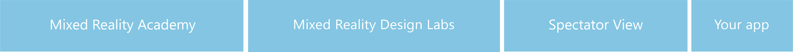
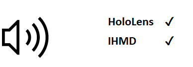
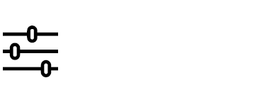
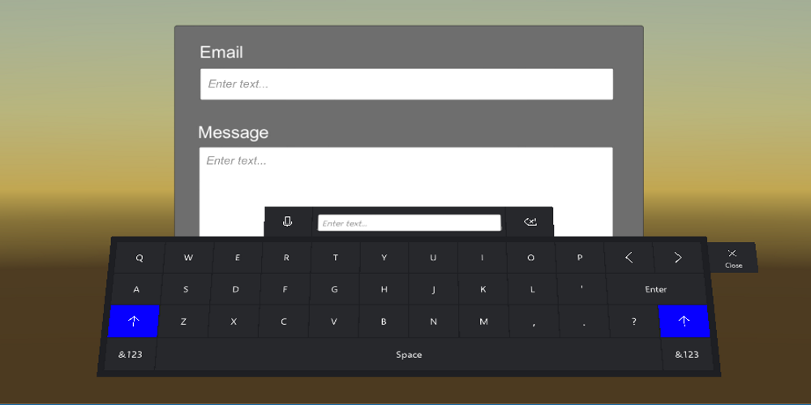
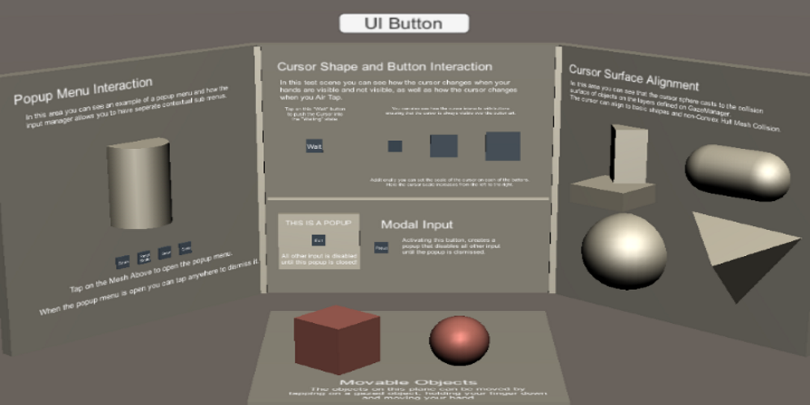
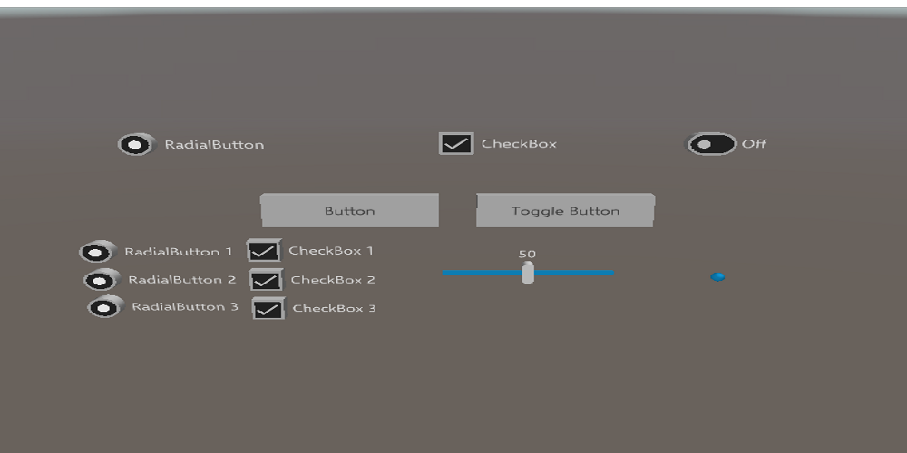

# What is MixedRealityToolkit-Unity?
The Mixed Reality Toolkit is a collection of scripts and components intended to accelerate development of applications targeting Microsoft HoloLens and Windows Mixed Reality headsets.
The project is aimed at reducing barriers to entry to create mixed reality applications and contribute back to the community as we all grow.

MixedRealityToolkit-Unity uses code from the base [MixedRealityToolkit](https://github.com/Microsoft/MixedRealityToolkit) and makes it easier to consume in [Unity](https://unity3d.com/).

> Learn more about [Windows Mixed Reality](https://www.microsoft.com/en-gb/windows/windows-mixed-reality) here

[github-rel]:                  https://github.com/Microsoft/MixedRealityToolkit-Unity/releases/latest
[github-rel-badge]:            https://img.shields.io/github/tag/microsoft/MixedRealityToolkit-unity.svg?style=flat-square&label=latest%20master%20branch%20release&colorB=007ec6
[![Github Release][github-rel-badge]][github-rel]

[unity-download]:                 http://beta.unity3d.com/download/edcd66fb22ae/download.html
[unity-version-badge]:            https://img.shields.io/badge/current%20unity%20editor%20version-2017.2.0f3%20MRTP-green.svg
[![Github Release][unity-version-badge]][unity-download]

[githubhl-rel]:                  https://github.com/Microsoft/MixedRealityToolkit-Unity/releases/latest
[mrtk-version-badge]:            https://img.shields.io/badge/HoloLens%20MRTK%20release-2017.1.2-blue.svg

[unity-release]:
https://unity3d.com/unity/whats-new/unity-2017.1.2
[githubhl-rel-badge]:            https://img.shields.io/badge/Unity%20HoloLens%20release-2017.1.2-blue.svg

Check out the updates from the [Fall Creators update](/FallCreatorsUpdate.md) for Windows Mixed Reality

> ## HoloLens Developers
> Currently we are waiting on a fix for HoloLens development from Unity, for now you should use the 2017.1.2 version of Unity and the "Release" version of the MRTK Asset:
>
> [![Github Release][mrtk-version-badge]][githubhl-rel]
>
> [![Github Release][githubhl-rel-badge]][unity-release]
>
> ### For existing HoloLens developers, also check out the [Breaking Changes](/BreakingChanges.md) information from the previous release.

Looking to upgrade your projects to Windows Mixed Reality? [Follow the Upgrade Guide](/UpgradeGuide.md).

# Feature areas
The Mixed Reality Toolkit for Unity includes many API's to accelerate the development of Mixed Reality projects for both HoloLens and the newer Immersive Headsets (IHMD)

|   [Input](Assets/HoloToolkit/Input/README.md)                                               |  [Sharing](Assets/HoloToolkit/Sharing/README.md)   |  [Spatial Mapping](Assets/HoloToolkit/SpatialMapping/README.md)| 
| :--- | :--- | :--- |
| Scripts that leverage inputs such as gaze, gesture, voice and motion controllers. | Sharing library enables collaboration across multiple devices. | Scripts that allow applications to bring the real world into the digital using HoloLens. | 
|  [Spatial Sound](Assets/HoloToolkit/SpatialSound/README.md) |  [UX Controls](Assets/HoloToolkit/UX/README.md)|  [Utilities](Assets/HoloToolkit/Utilities/README.md) | 
| Scripts to help plug spatial audio into your application. | Building blocks for creating good UX in your application like common controls. | Common helpers and tools that you can leverage in your application. |
|  [Spatial Understanding](Assets/HoloToolkit/SpatialUnderstanding/README.md)|  [Build](Assets/HoloToolkit/BuildAndDeploy/README.md)|  [Boundary](Assets/HoloToolkit/Boundary/README.md)                       |
| Tailor experiences based on room semantics like couch, wall etc.                                                                                  | Build and deploy automation window for Unity Editor.                                                        | Scripts that help with rendering the floor and boundaries for Immersive Devices.

# Required Software
|  [Windows 10 FCU](https://www.microsoft.com/software-download/windows10)|  [Unity 3D](https://unity3d.com/get-unity/download/archive)|  [Visual Studio 2017](http://dev.windows.com/downloads)|  [Simulator (optional)](https://go.microsoft.com/fwlink/?linkid=852626)|
| :--- | :--- | :--- | :--- |
| To develop apps for mixed reality headsets, you need the Windows 10 Fall Creators Update | The Unity 3D engine provides support for building mixed reality projects in Windows 10 | Visual Studio is used for code editing, deploying and building UWP app packages | The Emulators allow you test your app without the device in a simulated environment |

# Getting started with MRTK
To get up and going as quickly as possible, here are some guides to help you get started building Mixed Reality Projects

|  [Quick start](GettingStarted.md) |  [Contributing to this project](CONTRIBUTING.md) |  [Fall Creators Update](FallCreatorsUpdate.md) |
|:--- | :--- | :--- |
| Please go over the [Getting started guide](GettingStarted.md) to learn more about getting off the ground quickly. | Please go over the [Contributing guidelines](CONTRIBUTING.md) to learn more about the process and thinking. | Check out the recent updates for Windows Mixed reality in the [Fall Creators update](/FallCreatorsUpdate.md) |

# Examples and QuickStart scenes
The MRTK includes many great samples and starter scenes to demonstrate the uses of the MRTK API, these include:

|  [Keyboard input sample](/Assets/HoloToolkit-Examples) |  [Input manager tests](/Assets/HoloToolkit-Examples) |  [Interactive button demos](/Assets/HoloToolkit-Examples) |
|:--- | :--- | :--- |
| A sample virtual keyboard, similar to that used in the Mixed Reality Portal | Several gaze interaction demos, showcasing popups, gaze buttons and more | Example UI buttons and controls for use in Mixed Reality |
|  [Motion Controller tests](/Assets/HoloToolkit-Examples) |  [Grab Mechanics demo](/Assets/HoloToolkit-Examples/MotionControllers-GrabMechanics) |  [Scene occlusion demo](/Assets/HoloToolkit-Examples) |
| Motion controller test scene demonstrating controller variables (IHMB only) | Several examples of grab mechanics using the Motion Controllers (IHMD Only) | Scene construction demo on how to make occluded windows |

Check out the [Examples](/Assets/HoloToolkit-Examples) folder for more details.

# Roadmaps
### Master branch
| Target Unity release  | Release timeframe | Master release tag | Toolkit release features |
| --- | --- | --- | --- |
| 2017.2.0 | (current)       | v1.2017.2.0        | <ul><li>Updated master with Windows Mixed Reality support (xR namespace).</li><li>RI Dev_Unity_2017.2.0 into master.</li><li>Toolkit will work on both HoloLens and immersive headsets.</li><li>Windows Mixed Reality motion controller support.</li></ul>|
| 2017.3.0              | End Dec 2017      | v1.2017.3.0        | <ul><li>360 video player prefabs.</li><li>Scriptable foveated rendering prefabs.</li></ul>|

### Dev_Unity_2017.2.0 branch

| Target Unity release  | Release timeframe | Branch release tag | Branch pre-release features | Status |
| --- | --- | --- | --- | --- |
| 2017.2.1              | Mid Oct 2017      | v1.Dev.2017.2.1 | <ul><li>Merge branch into master.</li></ul>| Complete |

# Future work planning
- Updating landing page for the ReadMe.md to help app developers find content better.
- Updating API documentation using tools like Doxygen and not writing them manually. This is something we will work with all of you on.
- Update Wiki to host API documentation instead.
- Move reusable features from [Mixed Reality Design Labs](https://github.com/Microsoft/MRDesignLabs_Unity) project into toolkit.
- Improved samples and test cases

# Release cadence
### Master branch
- **Master branch releases** will align with **major Unity releases marking a release every 3 months**. Please read the [Unity roadmap](https://unity3d.com/unity/roadmap).
- Each release will be marked as a GitHub [release tag](https://github.com/Microsoft/HoloToolkit-Unity/releases). You can consume this release by:
	- Using the zip file available in the release notes
	- Unity packages available in the release notes
	- Syncing to the specific git tag you would like to lock on.
- Release tag name convention: v1.Unity release major number.Unity release minor number.Iteration number
	- For example: For Unity version 2017.1.0 our release tag would be **v1.2017.1.0**
	- If we marked another release with the same Unity version: **v1.2017.1.1**
- Unity packages for each release will be published to the Unity asset store.
- Unity packages for each feature area like Input/SpatialMapping will also be added to the release notes.
- Academy content will be updated with each major toolkit release.

### Development branches
- Development branches are great for incubating features before they make their way into master.
- These branches can be feature work or experimental features.
- Development branches might not be on the same Unity versions as master.
- For being merged into Master the dev branch will have to follow the cadence laid out for master.
- Development branches might choose to mark releases on a faster cadence based on customer/project needs.
- Recommend marking a development branch tag every 2 weeks as needed to ensure stability before making up to master.
- Development branches might be deleted once merged into master. If more work is pending, it's ok to continue working in them.

**External\How To** docs folder is meant to help everyone with migrating forward or any simple doubts they might have about the process.
Please feel free to grow all these sections. We can't wait to see your additions!

This project has adopted the [Microsoft Open Source Code of Conduct](https://opensource.microsoft.com/codeofconduct/). 
For more information see the [Code of Conduct FAQ](https://opensource.microsoft.com/codeofconduct/faq/) or contact [opencode@microsoft.com](mailto:opencode@microsoft.com) with any additional questions or comments.

# Useful resources on Microsoft Windows Dev Center
|  [Academy](https://developer.microsoft.com/en-us/windows/mixed-reality/academy)|  [Design](https://developer.microsoft.com/en-us/windows/mixed-reality/design)|  [Development](https://developer.microsoft.com/en-us/windows/mixed-reality/development)|  [Community](https://developer.microsoft.com/en-us/windows/mixed-reality/community)|
| :--------------------- | :----------------- | :------------------ | :------------------------ |
| See code examples. Do a coding tutorial. Watch guest lectures.          | Get design guides. Build user interface. Learn interactions and input.     | Get development guides. Learn the technology. Understand the science.       | Join open source projects. Ask questions on forums. Attend events and meetups. |
