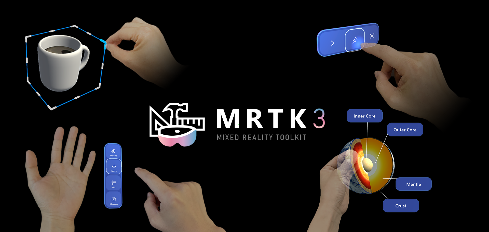
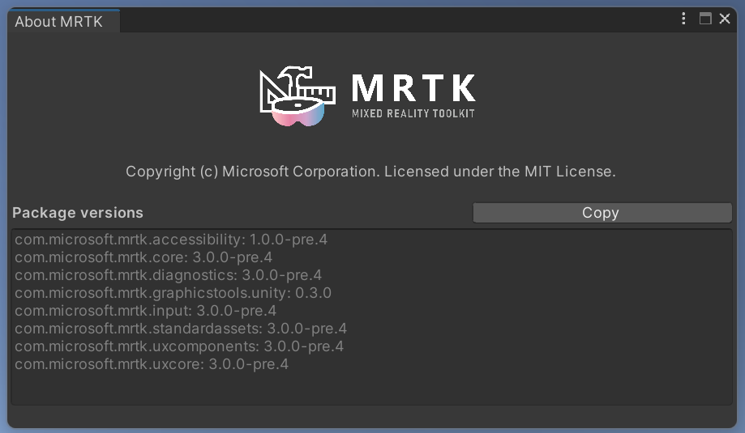

**MRTK3** is the third generation of the Microsoft Mixed Reality Toolkit for Unity. It's a Microsoft driven open source project designed to accelerate cross-platform mixed reality development in Unity. MRTK3 is built on top of [Unity's XR Interaction Toolkit (XRI)](https://docs.unity3d.com/Packages/com.unity.xr.interaction.toolkit@2.1/manual/index.html) and OpenXR. This new generation of MRTK is intended to be faster, cleaner, and more modular, with an easier cross-platform development workflow enabled by OpenXR and the Unity Input System. 

### Key improvements

**Architecture**

* Built on Unity XR Interaction Toolkit and the Unity Input System.
* Dedicated to OpenXR, with flexibility for other XRSDK backends
* Open-ended and extensible interaction paradigms across devices, platforms, and applications

**Performance**

* Rewrote and redesigned most features and systems, from UX to input to subsystems.
* Zero per-frame memory allocation.
* Tuned for maximum performance on HoloLens 2 and other resource-constrained mobile platforms.

**UI**

* New interaction models (gaze-pinch indirect manipulation).
* Updated Mixed Reality Design Language.
* Unity Canvas + 3D UX: production-grade dynamic auto-layout.
* Unified 2D & 3D input for gamepad, mouse, and accessibility support.
* Data binding for branding, theming, dynamic data, and complex lists.

MRTK3 is currently in **public preview.** We appreciate your feedback and contributions, but we caution that many APIs are still subject to change, and many features are either missing or buggy! We value your patience and your feedback as we work towards general availability (GA).

## Requirements

MRTK3 requires Unity 2020.3.42, 2021.3.14 or higher. In addition, you need the [Mixed Reality Feature Tool for Unity](https://aka.ms/mrfeaturetool) to find, download, and add the packages to your project.

## Getting started
[Follow the documentation for setting up MRTK3 packages as dependencies in your project here.](https://docs.microsoft.com/windows/mixed-reality/mrtk-unity/mrtk3-overview/setup) Alternatively, you can clone this repo directly to experiment with our template project. However, we *strongly* recommend adding MRTK3 packages as dependencies through the Feature Tool, as it makes updating, managing, and consuming MRTK3 packages far easier and less error-prone.

## Supported devices

| Platform | Supported Devices |
|---|---|
| OpenXR devices | Microsoft HoloLens 2   Meta Quest 1/2   Windows Mixed Reality (experimental)   SteamVR (experimental)   Oculus Rift on OpenXR (experimental)   Varjo XR-3 (experimental)   **If your OpenXR device already works with MRTK3, let us know!**
| Windows | Traditional flat-screen desktop (experimental)
| And more coming soon! |

## Versioning

In previous versions of MRTK (HoloToolkit and MRTK v2), all packages were released as a complete set, marked with the same version number (ex: 2.8.0). Starting with MRTK3 GA, each package will be individually versioned, following the [Semantic Versioning 2.0.0 specification](https://semver.org/spec/v2.0.0.html). (As a result, the '3' in MRTK3 is not a version number!)

Individual versioning will enable faster servicing while providing improved developer understanding of the magnitude of changes and reducing the number of packages needing to be updated to acquire the desired fix(es).

For example, if a non-breaking new feature is added to the UX core package, which contains the logic for user interface behavior the minor version number will increase (from 3.0.x to 3.1.0). Since the change is non-breaking, the UX components package, which depends upon UX core, is not required to be updated. 

As a result of this change, there is not a unified MRTK3 product version.

To help identify specific packages and their versions, MRTK3 provides an about dialog that lists the relevant packages included in the project. To access this dialog, select `Mixed Reality` > `MRTK3` > `About MRTK` from the Unity Editor menu.

## Early preview packages

Some parts of MRTK3 are at earlier stages of the development process than others. Early preview packages can be identified in the Mixed Reality Feature Tool and Unity Package Manager by the `Early Preview` designation in their names.

As of June 2022, the following components are considered to be in early preview.

| Name | Package Name |
| --- | --- |
| Accessibility | com.microsoft.mrtk.accessibility |
| Data Binding and Theming | com.microsoft.mrtk.data |
 
The MRTK team is fully committed to releasing this functionality. It is important to note that the packages may not contain the complete feature set that is planned to be released or they may undergo major, breaking architectural changes before release.

We very much encourage you to provide any and all feedback to help shape the final form of these early preview features.

# Roadmap

The roadmap from public preview to GA is detailed in the following table.

| Release | Timeline |
| --- | --- |
| Public Preview | June 8, 2022 |
| Preview updates | Approximately every 2-4 weeks until GA |
| General Availability | First quarter of 2023 |
